# Benchmarks

Every SDK writes **1,000,000** log records, spans and counter increments over OTLP/gRPC to one
in-process counting collector, so the numbers show what each SDK **delivered**, not only how
fast the calls returned. Regenerate with `just bench`; redraw this page from the saved
numbers (`docs/benchmarks.json`) with `just bench-render`.

Measured 2026-11-16 on Darwin arm64, 14 CPUs, Python 3.15.2.
Console log output is discarded (Go) or sent to /dev/null (Rust, Python), so the terminal is
not what is measured. **drop** is the default: a full export queue drops what does not fit,
counted and reported on close. **lossless** makes the writer wait for room instead.

## Starting point: the official SDKs

Each language's upstream OpenTelemetry SDK alone, with its default batch processor and
OTLP exporter, given the same burst. The calls return fast, and most of the records never
arrive: the batch processor's 2048-slot queue fills and drops the rest without a word.

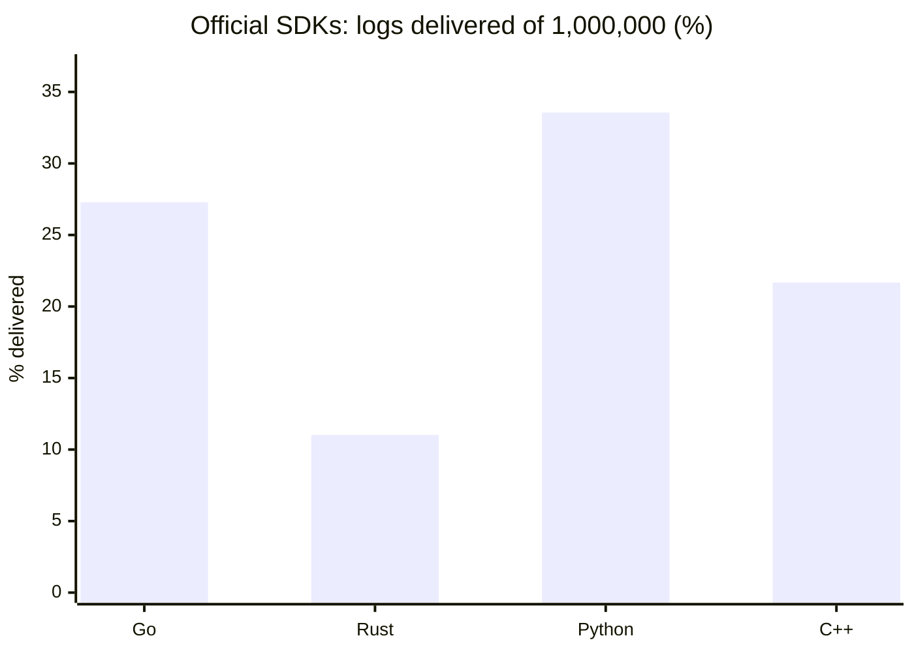
```mermaid
xychart-beta
    title "Official SDKs: logs delivered of 1,000,000 (%)"
    x-axis ["Go", "Rust", "Python", "C++"]
    y-axis "% delivered" 0 --> 36.9139
    bar [27.2896, 11.018, 33.5581, 21.676]
```

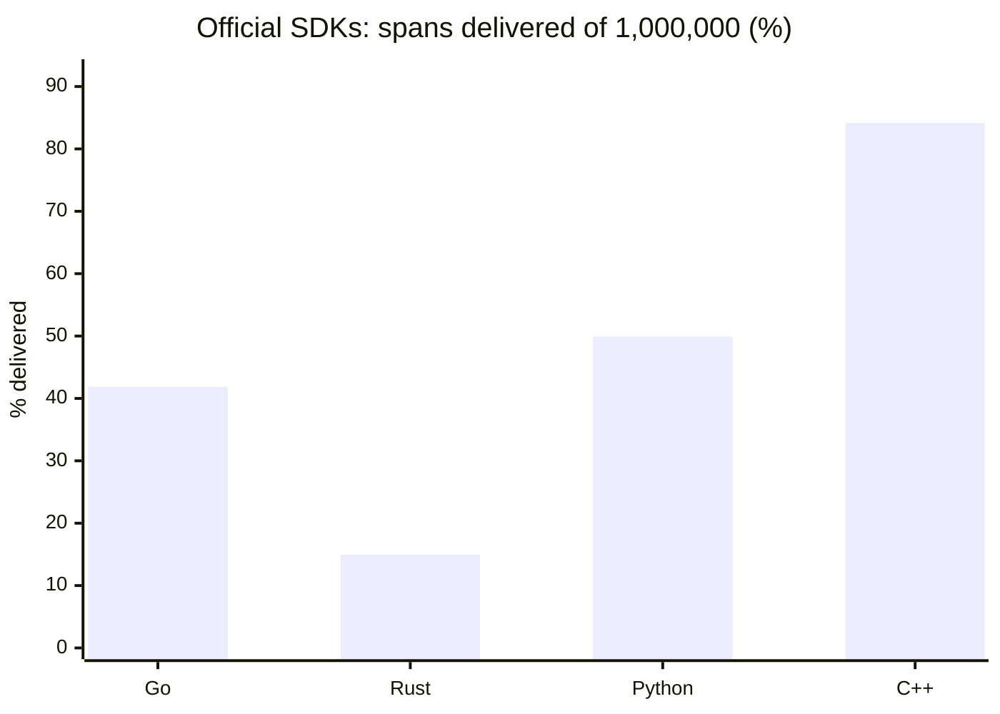
```mermaid
xychart-beta
    title "Official SDKs: spans delivered of 1,000,000 (%)"
    x-axis ["Go", "Rust", "Python", "C++"]
    y-axis "% delivered" 0 --> 92.5547
    bar [41.8816, 14.9536, 49.92, 84.1406]
```

### Step by step, in Go

Each step changes one thing, starting from the official SDK. The last row delivers every
record at the official SDK's speed for logs and twice it for spans. The official run uses
one thread, so read this as what each SDK can be made to deliver, not a like-for-like race.

| Step | Logs delivered | Logs / s | Spans delivered | Spans / s |
| ---- | -------------: | -------: | --------------: | --------: |
| Official Go SDK alone | 272,896 | 1,684,187 | 418,816 | 1,958,812 |
| This SDK, default: drops counted and reported | 569,955 | 552,613 | 588,575 | 1,729,006 |
| Lossless: the writer waits for room | 1,000,000 | 324,539 | 1,000,000 | 1,065,046 |
| Lossless, one goroutine per CPU, batch 8192 | 1,000,000 | 379,073 | 1,000,000 | 1,451,022 |
| Lossless, plus 4 exporters in parallel | 1,000,000 | 1,698,293 | 1,000,000 | 4,370,134 |

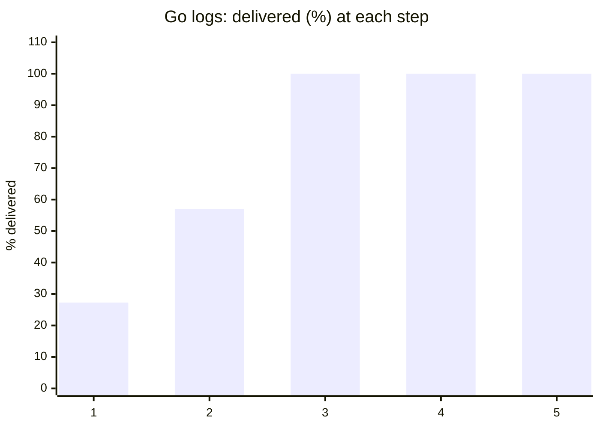
```mermaid
xychart-beta
    title "Go logs: delivered (%) at each step"
    x-axis ["1", "2", "3", "4", "5"]
    y-axis "% delivered" 0 --> 110
    bar [27.2896, 56.9955, 100, 100, 100]
```

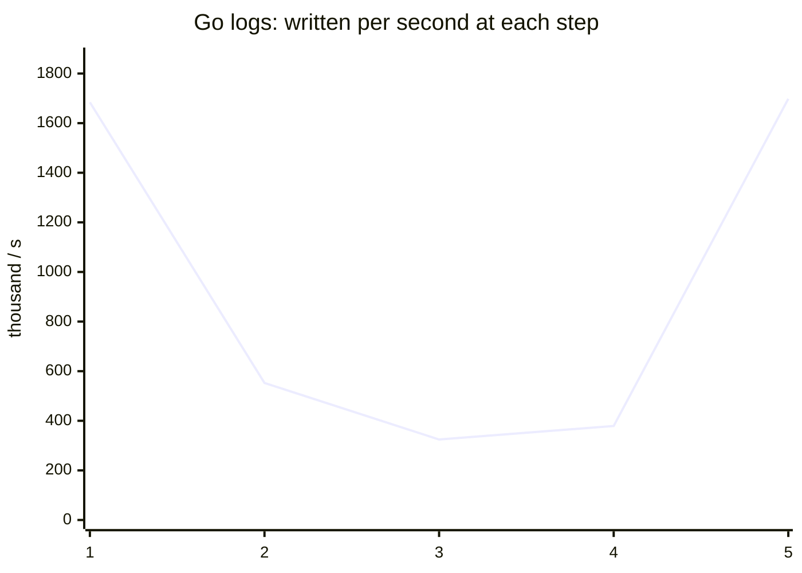
```mermaid
xychart-beta
    title "Go logs: written per second at each step"
    x-axis ["1", "2", "3", "4", "5"]
    y-axis "thousand / s" 0 --> 1868.12
    line [1684.19, 552.613, 324.539, 379.073, 1698.29]
```

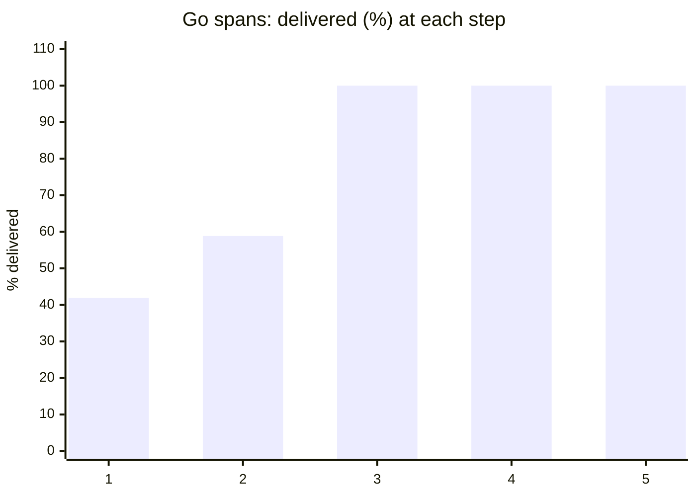
```mermaid
xychart-beta
    title "Go spans: delivered (%) at each step"
    x-axis ["1", "2", "3", "4", "5"]
    y-axis "% delivered" 0 --> 110
    bar [41.8816, 58.8575, 100, 100, 100]
```

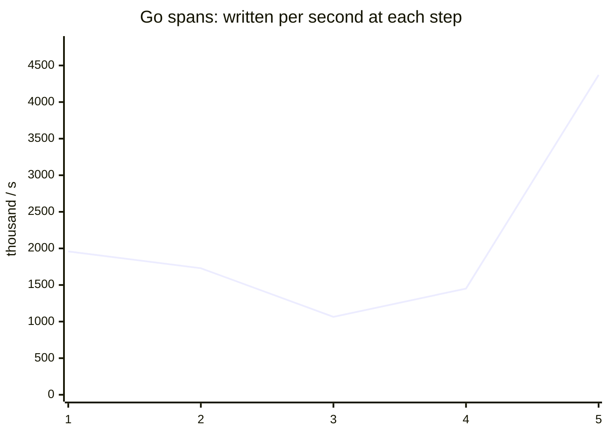
```mermaid
xychart-beta
    title "Go spans: written per second at each step"
    x-axis ["1", "2", "3", "4", "5"]
    y-axis "thousand / s" 0 --> 4807.15
    line [1958.81, 1729.01, 1065.05, 1451.02, 4370.13]
```

### Every language against its official SDK

This SDK's default and lossless modes beside the official SDK, one thread each. Above 1
means faster per call than the official SDK; the official SDK's speed is bought with the
records it drops.

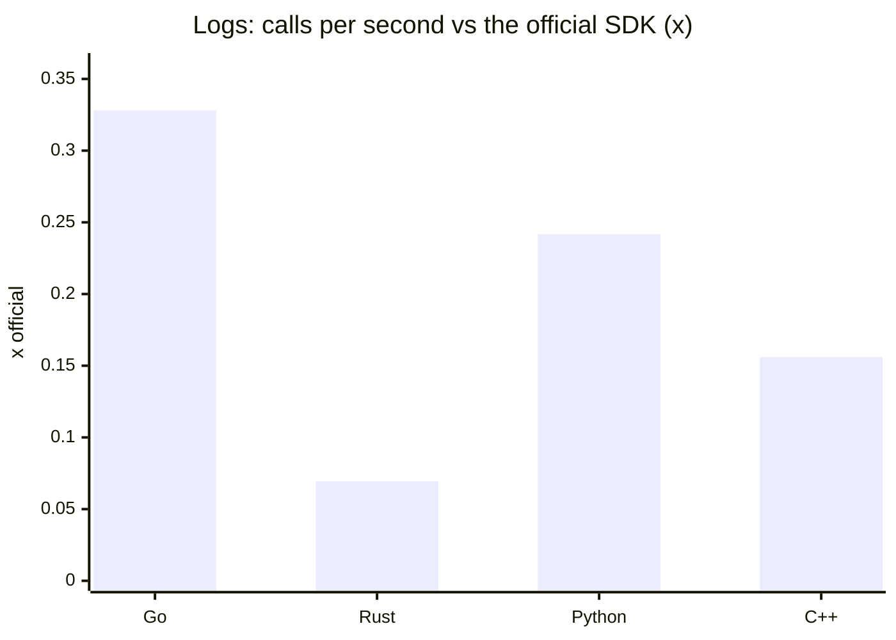
```mermaid
xychart-beta
    title "Logs: calls per second vs the official SDK (x)"
    x-axis ["Go", "Rust", "Python", "C++"]
    y-axis "x official" 0 --> 0.360931
    bar [0.328119, 0.0694659, 0.241827, 0.156026]
```

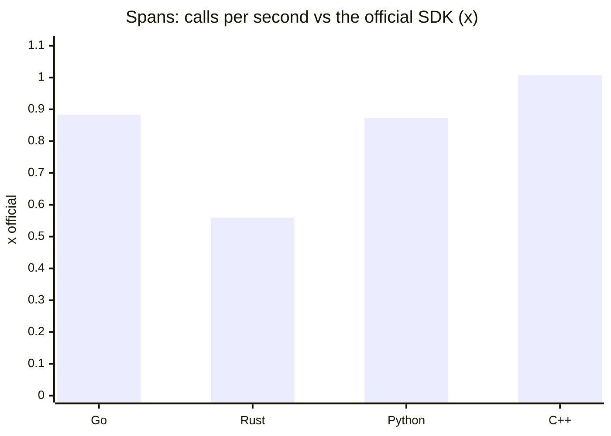
```mermaid
xychart-beta
    title "Spans: calls per second vs the official SDK (x)"
    x-axis ["Go", "Rust", "Python", "C++"]
    y-axis "x official" 0 --> 1.10818
    bar [0.882681, 0.559502, 0.873157, 1.00744]
```

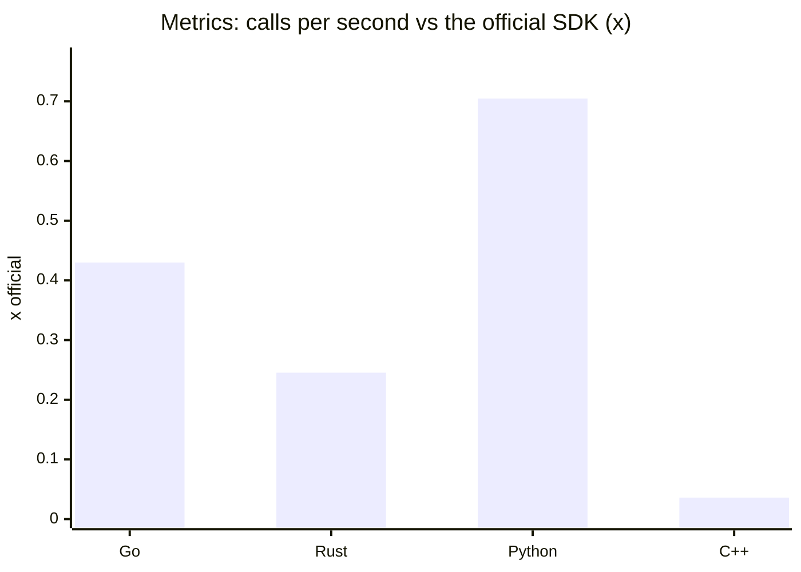
```mermaid
xychart-beta
    title "Metrics: calls per second vs the official SDK (x)"
    x-axis ["Go", "Rust", "Python", "C++"]
    y-axis "x official" 0 --> 0.775054
    bar [0.429916, 0.245346, 0.704594, 0.0359867]
```

| Language | Signal | Official: delivered | Official: rate | This SDK, drop: delivered | rate | Lossless: delivered | rate |
| -------- | ------ | ------------------: | -------------: | ------------------------: | ---: | ------------------: | ---: |
| Go | logs | 272,896 | 1,684,187/s | 569,955 | 552,613/s | 1,000,000 | 324,539/s |
| Rust | logs | 110,180 | 7,703,681/s | 681,750 | 535,143/s | 1,000,000 | 428,597/s |
| Python | logs | 335,581 | 108,417/s | 455,168 | 26,218/s | 1,000,000 | 25,151/s |
| C++ | logs | 216,760 | 4,572,518/s | 1,000,000 | 713,430/s | — | — |
| Go | spans | 418,816 | 1,958,812/s | 588,575 | 1,729,006/s | 1,000,000 | 1,065,046/s |
| Rust | spans | 149,536 | 7,856,799/s | 289,837 | 4,395,896/s | 1,000,000 | 1,764,274/s |
| Python | spans | 499,200 | 72,297/s | 557,946 | 63,127/s | 1,000,000 | 54,776/s |
| C++ | spans | 841,406 | 1,977,402/s | 920,819 | 1,992,106/s | — | — |
| Go | metrics | 1,000,000 | 18,768,299/s | 1,000,000 | 8,068,786/s | 1,000,000 | 7,534,522/s |
| Rust | metrics | 1,000,000 | 110,705,192/s | 1,000,000 | 27,161,027/s | 1,000,000 | 27,377,165/s |
| Python | metrics | 1,000,000 | 601,944/s | 1,000,000 | 424,126/s | 1,000,000 | 434,398/s |
| C++ | metrics | 1,000,000 | 56,098,360/s | 1,000,000 | 2,018,797/s | — | — |

## At a glance

### Logs

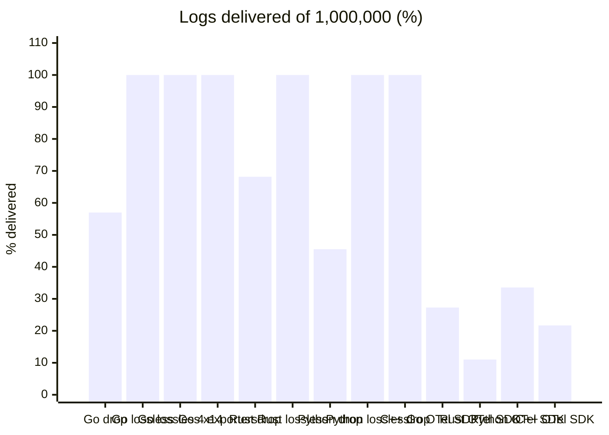
```mermaid
xychart-beta
    title "Logs delivered of 1,000,000 (%)"
    x-axis ["Go drop", "Go lossless", "Go lossless x14", "Go 4 exporters", "Rust drop", "Rust lossless", "Python drop", "Python lossless", "C++ drop", "Go OTel SDK", "Rust OTel SDK", "Python OTel SDK", "C++ OTel SDK"]
    y-axis "% delivered" 0 --> 110
    bar [56.9955, 100, 100, 100, 68.175, 100, 45.5168, 100, 100, 27.2896, 11.018, 33.5581, 21.676]
```

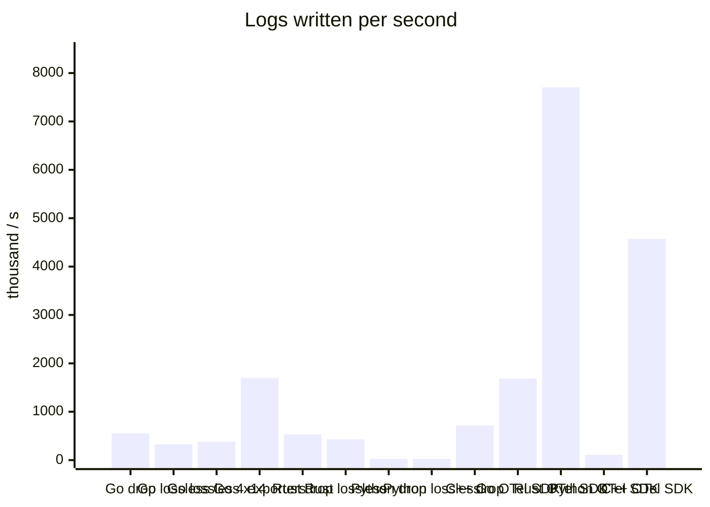
```mermaid
xychart-beta
    title "Logs written per second"
    x-axis ["Go drop", "Go lossless", "Go lossless x14", "Go 4 exporters", "Rust drop", "Rust lossless", "Python drop", "Python lossless", "C++ drop", "Go OTel SDK", "Rust OTel SDK", "Python OTel SDK", "C++ OTel SDK"]
    y-axis "thousand / s" 0 --> 8474.05
    bar [552.613, 324.539, 379.073, 1698.29, 535.143, 428.597, 26.2181, 25.1511, 713.43, 1684.19, 7703.68, 108.417, 4572.52]
```

### Spans

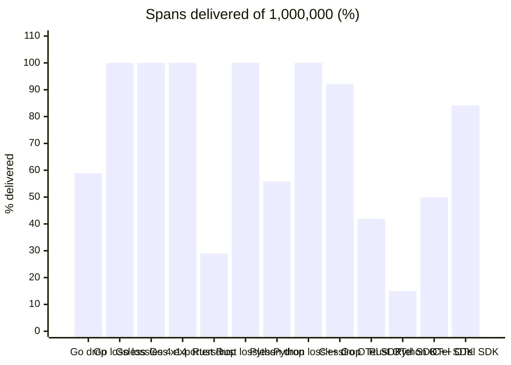
```mermaid
xychart-beta
    title "Spans delivered of 1,000,000 (%)"
    x-axis ["Go drop", "Go lossless", "Go lossless x14", "Go 4 exporters", "Rust drop", "Rust lossless", "Python drop", "Python lossless", "C++ drop", "Go OTel SDK", "Rust OTel SDK", "Python OTel SDK", "C++ OTel SDK"]
    y-axis "% delivered" 0 --> 110
    bar [58.8575, 100, 100, 100, 28.9837, 100, 55.7946, 100, 92.0819, 41.8816, 14.9536, 49.92, 84.1406]
```

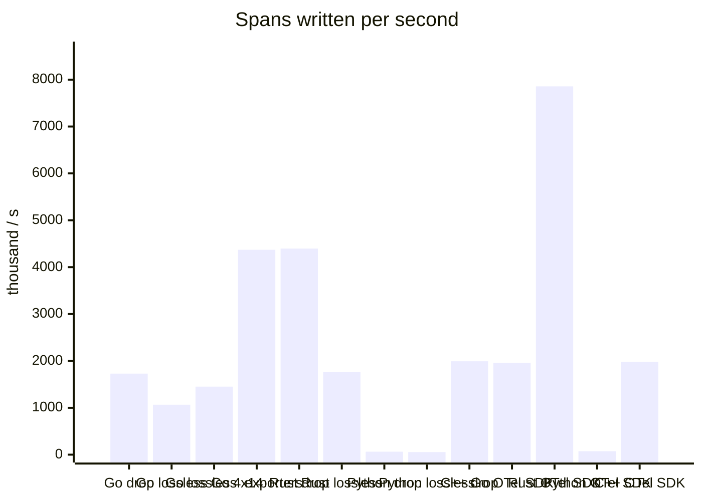
```mermaid
xychart-beta
    title "Spans written per second"
    x-axis ["Go drop", "Go lossless", "Go lossless x14", "Go 4 exporters", "Rust drop", "Rust lossless", "Python drop", "Python lossless", "C++ drop", "Go OTel SDK", "Rust OTel SDK", "Python OTel SDK", "C++ OTel SDK"]
    y-axis "thousand / s" 0 --> 8642.48
    bar [1729.01, 1065.05, 1451.02, 4370.13, 4395.9, 1764.27, 63.1266, 54.7763, 1992.11, 1958.81, 7856.8, 72.297, 1977.4]
```

### Metrics

Every configuration delivers every increment: a counter exports its running total.

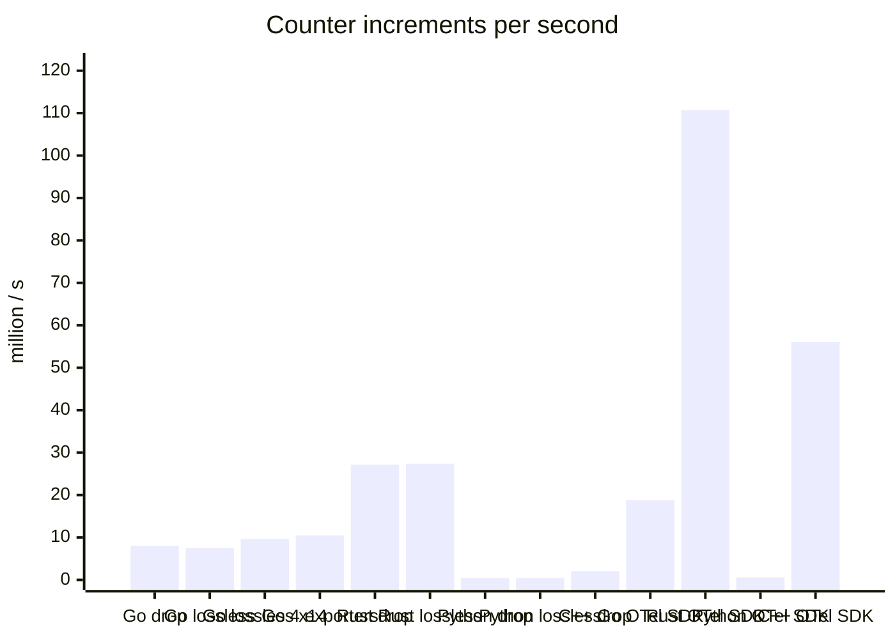
```mermaid
xychart-beta
    title "Counter increments per second"
    x-axis ["Go drop", "Go lossless", "Go lossless x14", "Go 4 exporters", "Rust drop", "Rust lossless", "Python drop", "Python lossless", "C++ drop", "Go OTel SDK", "Rust OTel SDK", "Python OTel SDK", "C++ OTel SDK"]
    y-axis "million / s" 0 --> 121.776
    bar [8.06879, 7.53452, 9.65458, 10.4526, 27.161, 27.3772, 0.424126, 0.434398, 2.0188, 18.7683, 110.705, 0.601944, 56.0984]
```

### Logs: speed against delivery

Right is faster (log scale, 1k/s to 10M/s); up is more of the records delivered.

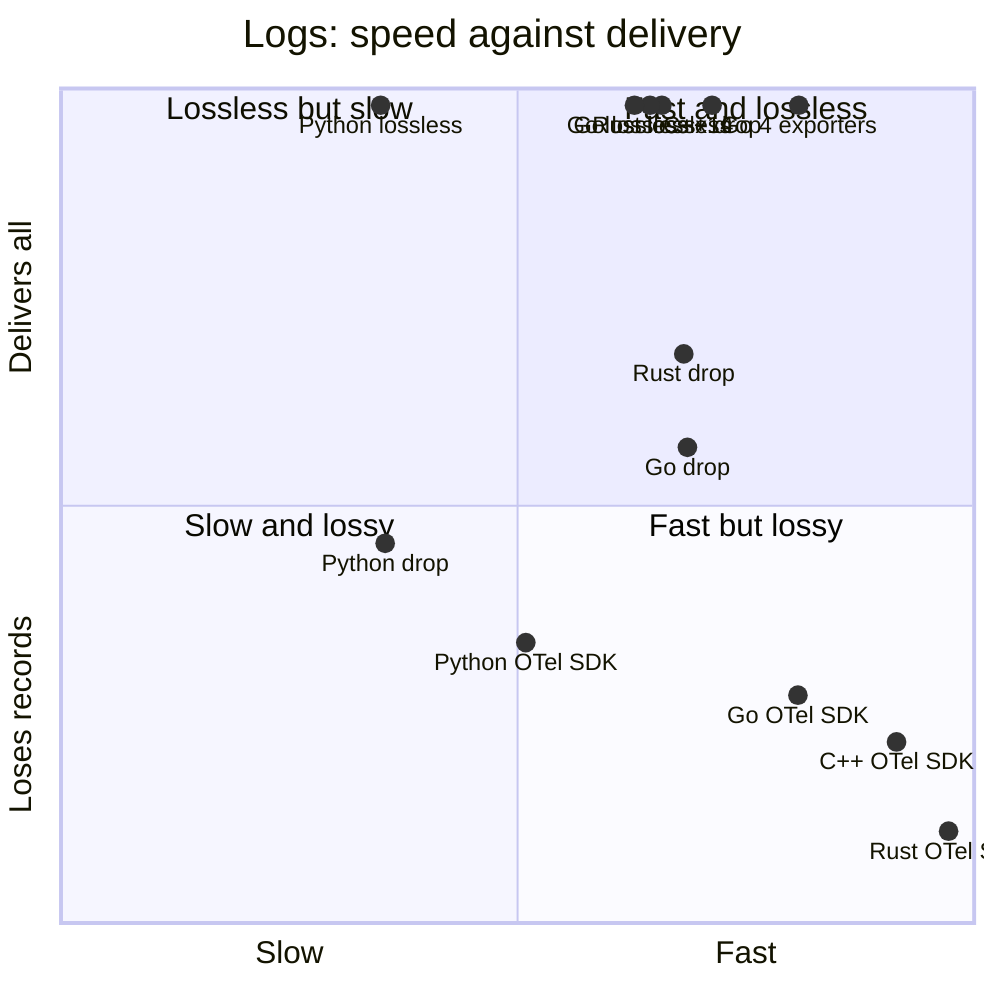
```mermaid
quadrantChart
    title Logs: speed against delivery
    x-axis Slow --> Fast
    y-axis Loses records --> Delivers all
    quadrant-1 Fast and lossless
    quadrant-2 Lossless but slow
    quadrant-3 Slow and lossy
    quadrant-4 Fast but lossy
    Go drop: [0.686, 0.570]
    Go lossless: [0.628, 0.980]
    Go lossless x14: [0.645, 0.980]
    Go 4 exporters: [0.808, 0.980]
    Rust drop: [0.682, 0.682]
    Rust lossless: [0.658, 0.980]
    Python drop: [0.355, 0.455]
    Python lossless: [0.350, 0.980]
    C++ drop: [0.713, 0.980]
    Go OTel SDK: [0.807, 0.273]
    Rust OTel SDK: [0.972, 0.110]
    Python OTel SDK: [0.509, 0.336]
    C++ OTel SDK: [0.915, 0.217]
```

### Spans: speed against delivery

Right is faster (log scale, 1k/s to 10M/s); up is more of the records delivered.

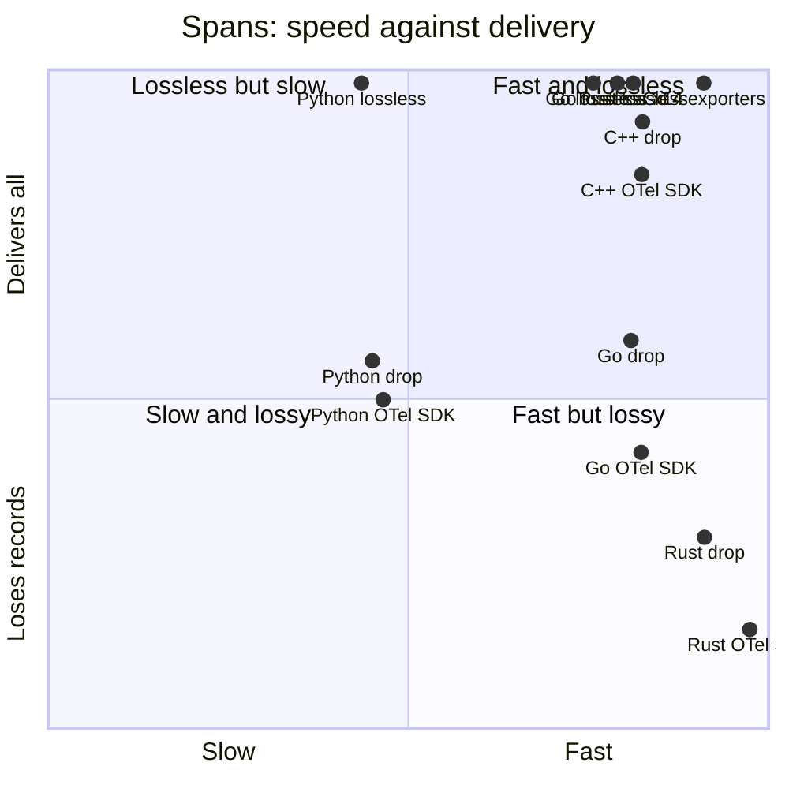
```mermaid
quadrantChart
    title Spans: speed against delivery
    x-axis Slow --> Fast
    y-axis Loses records --> Delivers all
    quadrant-1 Fast and lossless
    quadrant-2 Lossless but slow
    quadrant-3 Slow and lossy
    quadrant-4 Fast but lossy
    Go drop: [0.809, 0.589]
    Go lossless: [0.757, 0.980]
    Go lossless x14: [0.790, 0.980]
    Go 4 exporters: [0.910, 0.980]
    Rust drop: [0.911, 0.290]
    Rust lossless: [0.812, 0.980]
    Python drop: [0.450, 0.558]
    Python lossless: [0.435, 0.980]
    C++ drop: [0.825, 0.921]
    Go OTel SDK: [0.823, 0.419]
    Rust OTel SDK: [0.974, 0.150]
    Python OTel SDK: [0.465, 0.499]
    C++ OTel SDK: [0.824, 0.841]
```

### Where the records went (default mode)

With the default drop-when-full queue, a burst faster than the collector loses what
does not fit; every SDK now counts it and reports it on close.

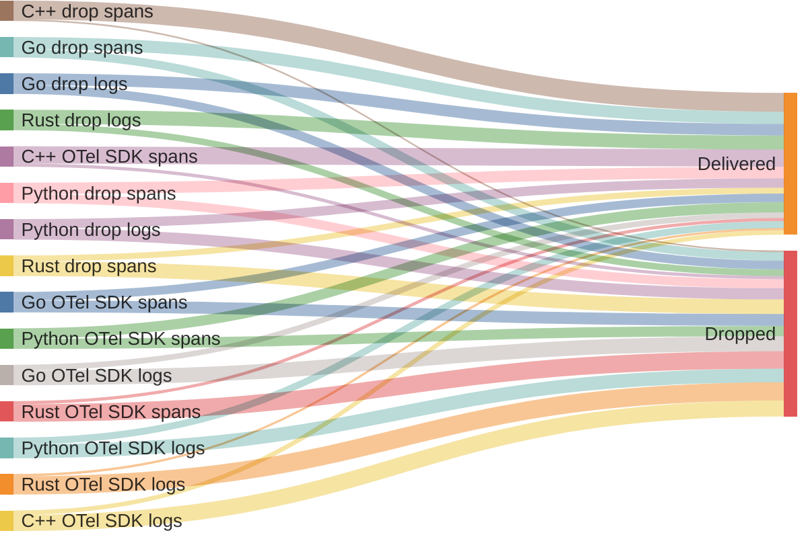
```mermaid
---
config:
  sankey:
    showValues: false
    linkColor: source
---
sankey-beta

Go drop logs,Delivered,569955
Go drop logs,Dropped,430045
Go drop spans,Delivered,588575
Go drop spans,Dropped,411425
Rust drop logs,Delivered,681750
Rust drop logs,Dropped,318250
Rust drop spans,Delivered,289837
Rust drop spans,Dropped,710163
Python drop logs,Delivered,455168
Python drop logs,Dropped,544832
Python drop spans,Delivered,557946
Python drop spans,Dropped,442054
C++ drop spans,Delivered,920819
C++ drop spans,Dropped,79181
Go OTel SDK logs,Delivered,272896
Go OTel SDK logs,Dropped,727104
Go OTel SDK spans,Delivered,418816
Go OTel SDK spans,Dropped,581184
Rust OTel SDK logs,Delivered,110180
Rust OTel SDK logs,Dropped,889820
Rust OTel SDK spans,Delivered,149536
Rust OTel SDK spans,Dropped,850464
Python OTel SDK logs,Delivered,335581
Python OTel SDK logs,Dropped,664419
Python OTel SDK spans,Delivered,499200
Python OTel SDK spans,Dropped,500800
C++ OTel SDK logs,Delivered,216760
C++ OTel SDK logs,Dropped,783240
C++ OTel SDK spans,Delivered,841406
C++ OTel SDK spans,Dropped,158594
```

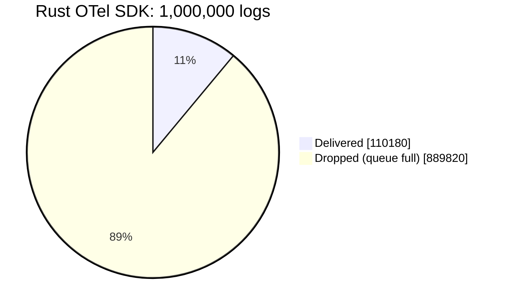
```mermaid
pie showData title Rust OTel SDK: 1,000,000 logs
    "Delivered" : 110180
    "Dropped (queue full)" : 889820
```

### Go: more exporters, more throughput

Measured 2026-11-16: 2,000,000 records per signal, lossless, 14 goroutines, batch 8192, to the in-process collector. Upper line spans, lower line logs (thousand / s).

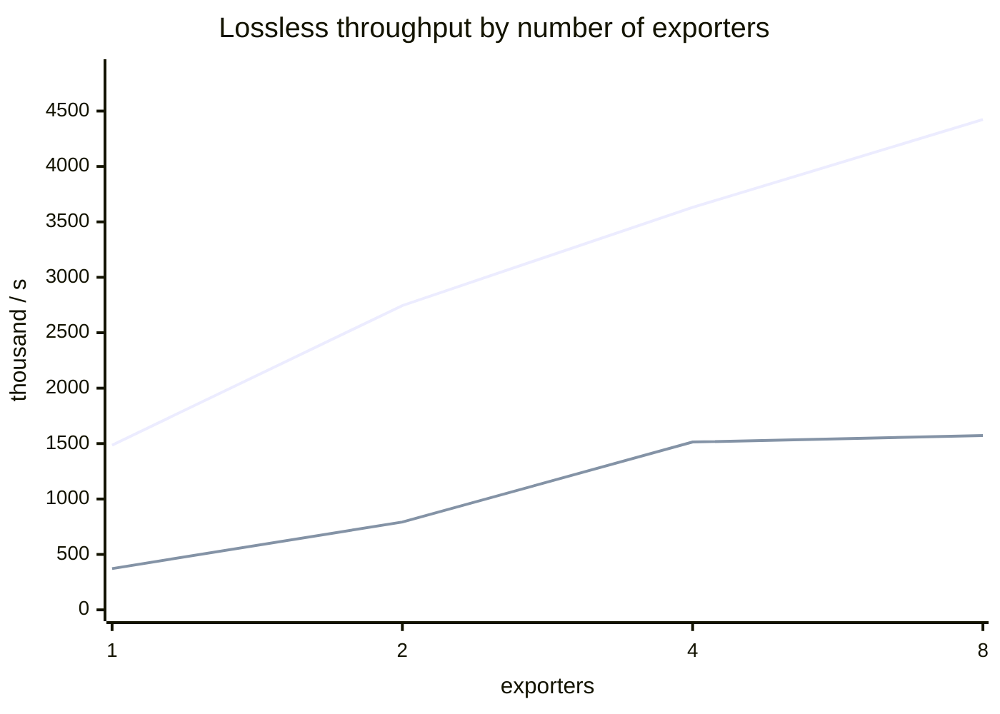
```mermaid
xychart-beta
    title "Lossless throughput by number of exporters"
    x-axis "exporters" [1, 2, 4, 8]
    y-axis "thousand / s" 0 --> 4865
    line [1486, 2745, 3631, 4423]
    line [372, 792, 1514, 1572]
```

### MCAP recording

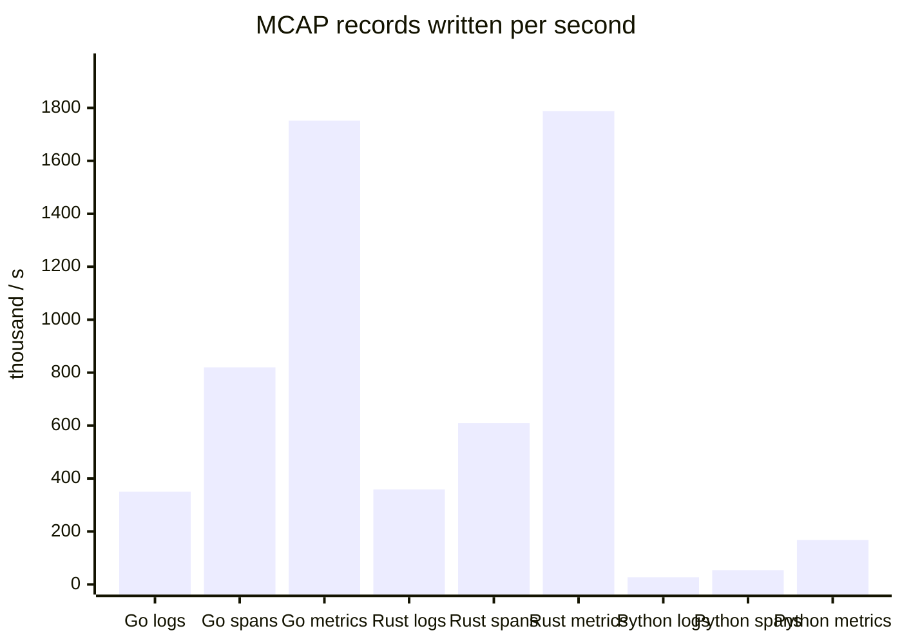
```mermaid
xychart-beta
    title "MCAP records written per second"
    x-axis ["Go logs", "Go spans", "Go metrics", "Rust logs", "Rust spans", "Rust metrics", "Python logs", "Python spans", "Python metrics"]
    y-axis "thousand / s" 0 --> 1967.03
    bar [350.269, 819.879, 1751.52, 358.723, 609.114, 1788.21, 27.1713, 53.8683, 167.626]
```

```mermaid
xychart-beta
    title "MCAP bytes per record (zstd)"
    x-axis ["Go logs", "Go spans", "Go metrics", "Rust logs", "Rust spans", "Rust metrics", "Python logs", "Python spans", "Python metrics"]
    y-axis "bytes" 0 --> 64.7078
    bar [28.6481, 58.8253, 19.7451, 28.9376, 58.3766, 19.1185, 29.9805, 58.7924, 24.3043]
```

### Go: cost of one call

```mermaid
xychart-beta
    title "Go SDK nanoseconds per call"
    x-axis ["LogInfo/export=false", "LogInfo/export=false-8", "LogInfo/export=true", "LogInfo/export=true-8", "Span/export=false", "Span/export=false-8", "Span/export=true", "Span/export=true-8", "Counter", "Counter-8"]
    y-axis "ns / op" 0 --> 1697.3
    bar [101.1, 76.94, 1543, 428.5, 105.2, 30.51, 509.4, 170.4, 111.1, 75.28]
```

## OTLP export

| SDK | Mode | Signal | Delivered | Lost | Emit rate | Per call | Flush on close |
| --- | ---- | ------ | --------: | ---: | --------: | -------: | -------------: |
| Go | default (drop when full), 1 goroutine | logs | 569,955 | 43.0% | 552,613/s | 1,810 ns | 0.01 s |
| Go | default (drop when full), 1 goroutine | spans | 588,575 | 41.1% | 1,729,006/s | 578 ns | 0.00 s |
| Go | default (drop when full), 1 goroutine | metrics | 1,000,000 | 0.0% | 8,068,786/s | 124 ns | 0.00 s |
| Go | Lossless, 1 goroutine | logs | 1,000,000 | 0.0% | 324,539/s | 3,081 ns | 0.01 s |
| Go | Lossless, 1 goroutine | spans | 1,000,000 | 0.0% | 1,065,046/s | 939 ns | 0.00 s |
| Go | Lossless, 1 goroutine | metrics | 1,000,000 | 0.0% | 7,534,522/s | 133 ns | 0.00 s |
| Go | Lossless, 14 goroutines, batch 8192 | logs | 1,000,000 | 0.0% | 379,073/s | 2,638 ns | 0.21 s |
| Go | Lossless, 14 goroutines, batch 8192 | spans | 1,000,000 | 0.0% | 1,451,022/s | 689 ns | 0.05 s |
| Go | Lossless, 14 goroutines, batch 8192 | metrics | 1,000,000 | 0.0% | 9,654,579/s | 104 ns | 0.00 s |
| Go | Lossless, 14 goroutines, batch 8192, 4 exporters | logs | 1,000,000 | 0.0% | 1,698,293/s | 589 ns | 0.23 s |
| Go | Lossless, 14 goroutines, batch 8192, 4 exporters | spans | 1,000,000 | 0.0% | 4,370,134/s | 229 ns | 0.06 s |
| Go | Lossless, 14 goroutines, batch 8192, 4 exporters | metrics | 1,000,000 | 0.0% | 10,452,575/s | 96 ns | 0.00 s |
| Rust | default (drop when full) | logs | 681,750 | 31.8% | 535,143/s | 1,869 ns | 0.01 s |
| Rust | default (drop when full) | spans | 289,837 | 71.0% | 4,395,896/s | 227 ns | 0.00 s |
| Rust | default (drop when full) | metrics | 1,000,000 | 0.0% | 27,161,027/s | 37 ns | 0.00 s |
| Rust | Lossless | logs | 1,000,000 | 0.0% | 428,597/s | 2,333 ns | 0.14 s |
| Rust | Lossless | spans | 1,000,000 | 0.0% | 1,764,274/s | 567 ns | 0.03 s |
| Rust | Lossless | metrics | 1,000,000 | 0.0% | 27,377,165/s | 37 ns | 0.00 s |
| Python | default (drop when full) | logs | 455,168 | 54.5% | 26,218/s | 38,142 ns | 0.03 s |
| Python | default (drop when full) | spans | 557,946 | 44.2% | 63,127/s | 15,841 ns | 0.01 s |
| Python | default (drop when full) | metrics | 1,000,000 | 0.0% | 424,126/s | 2,358 ns | 0.00 s |
| Python | Lossless | logs | 1,000,000 | 0.0% | 25,151/s | 39,760 ns | 0.71 s |
| Python | Lossless | spans | 1,000,000 | 0.0% | 54,776/s | 18,256 ns | 0.07 s |
| Python | Lossless | metrics | 1,000,000 | 0.0% | 434,398/s | 2,302 ns | 0.00 s |
| C++ | default (drop when full) | logs | 1,000,000 | 0.0% | 713,430/s | 1,402 ns | 0.00 s |
| C++ | default (drop when full) | spans | 920,819 | 7.9% | 1,992,106/s | 502 ns | 0.00 s |
| C++ | default (drop when full) | metrics | 1,000,000 | 0.0% | 2,018,797/s | 495 ns | 0.00 s |
| Go | official OpenTelemetry SDK alone (default batch processor) | logs | 272,896 | 72.7% | 1,684,187/s | 594 ns | 0.00 s |
| Go | official OpenTelemetry SDK alone (default batch processor) | spans | 418,816 | 58.1% | 1,958,812/s | 511 ns | 0.00 s |
| Go | official OpenTelemetry SDK alone (default batch processor) | metrics | 1,000,000 | 0.0% | 18,768,299/s | 53 ns | 0.00 s |
| Rust | official OpenTelemetry SDK alone (default batch processor) | logs | 110,180 | 89.0% | 7,703,681/s | 130 ns | 0.00 s |
| Rust | official OpenTelemetry SDK alone (default batch processor) | spans | 149,536 | 85.0% | 7,856,799/s | 127 ns | 0.00 s |
| Rust | official OpenTelemetry SDK alone (default batch processor) | metrics | 1,000,000 | 0.0% | 110,705,192/s | 9 ns | 0.00 s |
| Python | official OpenTelemetry SDK alone (default batch processor) | logs | 335,581 | 66.4% | 108,417/s | 9,224 ns | 0.01 s |
| Python | official OpenTelemetry SDK alone (default batch processor) | spans | 499,200 | 50.1% | 72,297/s | 13,832 ns | 0.01 s |
| Python | official OpenTelemetry SDK alone (default batch processor) | metrics | 1,000,000 | 0.0% | 601,944/s | 1,661 ns | 0.00 s |
| C++ | official OpenTelemetry SDK alone (default batch processor) | logs | 216,760 | 78.3% | 4,572,518/s | 219 ns | 0.00 s |
| C++ | official OpenTelemetry SDK alone (default batch processor) | spans | 841,406 | 15.9% | 1,977,402/s | 506 ns | 0.00 s |
| C++ | official OpenTelemetry SDK alone (default batch processor) | metrics | 1,000,000 | 0.0% | 56,098,360/s | 18 ns | 0.00 s |

**Lost** is what never reached the collector. Metrics are aggregated in-process (a counter
exports its running total), so they cannot lose increments; logs and spans are exported one by
one through a bounded queue, and a queue that fills either drops (default) or makes the
program wait (lossless). Every SDK counts what it dropped and reports it on close.

## MCAP recording

The same 1,000,000 records per signal, recorded to an MCAP file for Foxglove with OTLP off,
then read back with the `mcap` library: **Recorded** is what the file holds.

| SDK | Signal | Recorded | Write rate | Per call | File size | Bytes / record |
| --- | ------ | -------: | ---------: | -------: | --------: | -------------: |
| Go | logs | 1,000,000 | 350,269/s | 2,855 ns | 27.3 MiB | 29 |
| Go | spans | 1,000,000 | 819,879/s | 1,220 ns | 56.1 MiB | 59 |
| Go | metrics | 1,000,000 | 1,751,516/s | 571 ns | 18.8 MiB | 20 |
| Rust | logs | 1,000,000 | 358,723/s | 2,788 ns | 27.6 MiB | 29 |
| Rust | spans | 1,000,000 | 609,114/s | 1,642 ns | 55.7 MiB | 58 |
| Rust | metrics | 1,000,000 | 1,788,208/s | 559 ns | 18.2 MiB | 19 |
| Python | logs | 1,000,000 | 27,171/s | 36,804 ns | 28.6 MiB | 30 |
| Python | spans | 1,000,000 | 53,868/s | 18,564 ns | 56.1 MiB | 59 |
| Python | metrics | 1,000,000 | 167,626/s | 5,966 ns | 23.2 MiB | 24 |

## Go: cost per call

`go test -bench . ./telemetry-go` — `export=false` is the SDK's own overhead with nothing
exported; `export=true` exports to an in-process collector. `-8` runs 8 goroutines in parallel.

| Benchmark | ns/op | B/op | allocs/op |
| --------- | ----: | ---: | --------: |
| `BenchmarkLogInfo/export=false` | 101.1 | 336 | 2 |
| `BenchmarkLogInfo/export=false-8` | 76.94 | 336 | 2 |
| `BenchmarkLogInfo/export=true` | 1543 | 1638 | 7 |
| `BenchmarkLogInfo/export=true-8` | 428.5 | 1868 | 10 |
| `BenchmarkSpan/export=false` | 105.2 | 240 | 5 |
| `BenchmarkSpan/export=false-8` | 30.51 | 240 | 5 |
| `BenchmarkSpan/export=true` | 509.4 | 1155 | 7 |
| `BenchmarkSpan/export=true-8` | 170.4 | 1149 | 7 |
| `BenchmarkCounter` | 111.1 | 43 | 2 |
| `BenchmarkCounter-8` | 75.28 | 42 | 2 |
