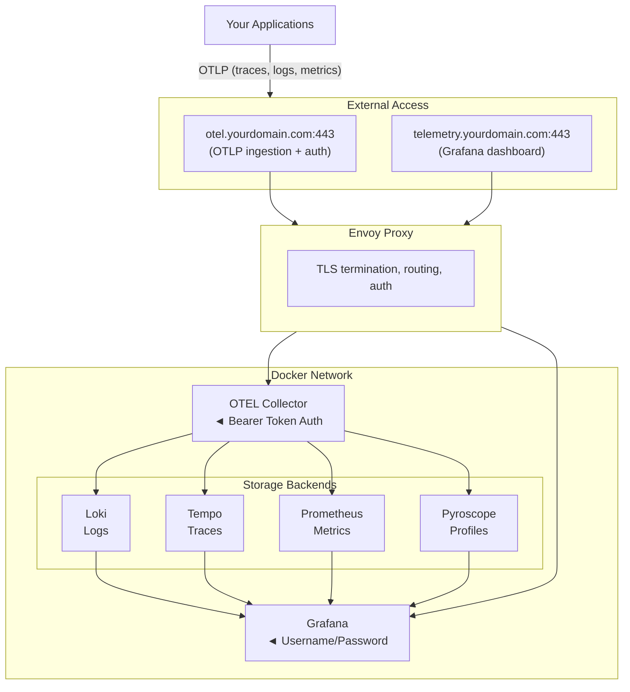

# Production Deployment

Deploy the observability stack to AWS EC2, EKS, or run locally with Docker Compose.

## Features

- **Grafana** - Unified dashboard for all telemetry
- **Loki** - Log aggregation
- **Tempo** - Distributed tracing
- **Prometheus** - Metrics collection
- **Pyroscope** - Continuous profiling
- **OpenTelemetry Collector** - Unified telemetry ingestion
- **Alertmanager** - Alert routing and notifications
- **Envoy Proxy** - TLS termination and routing

## Architecture



## Deployment Options

| Option | Best For | Cost |
|--------|----------|------|
| **EC2** | Production, single instance | ~$15-20/month |
| **EKS** | Production, scalable | ~$90+/month |
| **Docker** | Local development | Free |

## Quick Start

### Prerequisites (Nix)

The easiest way to get all dependencies is with Nix:

```bash
cd deploy/production

# Option 1: Using nix develop (flakes)
nix develop

# Option 2: Using nix-shell (legacy)
nix-shell

# Option 3: Using direnv (auto-activates on cd)
direnv allow
```

This provides: `terraform`, `awscli`, `docker-compose`, `kubectl`, `openssl`, etc.

### Option 1: Local Docker (Development)

```bash
cd deploy/production

# Enter nix shell (or ensure dependencies are installed)
nix develop

# Configure
cp .env.example .env
nano .env  # Set your credentials

# Deploy
./scripts/deploy-docker.sh
```

Access at `https://localhost`

### Option 2: AWS EC2 with NixOS (Recommended)

```bash
cd deploy/production

# Enter nix shell
nix develop

# Configure
cp .env.example .env
nano .env  # Set DOMAIN, OTEL_DOMAIN, credentials

# Deploy infrastructure with Terraform
cd terraform
terraform init
terraform apply
cd ..

# Provision NixOS and deploy (converts Amazon Linux to NixOS)
telemetry-deploy provision <EC2_PUBLIC_IP>

# Or if already NixOS, just deploy updates:
telemetry-deploy deploy <EC2_PUBLIC_IP>
```

**Nix Deploy Commands:**

```bash
telemetry-deploy provision <ip>  # Fresh instance: install NixOS + deploy
telemetry-deploy deploy <ip>     # Update existing NixOS instance
telemetry-deploy status <ip>     # Check container status
telemetry-deploy logs <ip>       # View logs
telemetry-deploy certs <ip>      # Setup Let's Encrypt
telemetry-deploy ssh <ip>        # SSH into instance
```

### Option 2b: AWS EC2 with Bash Scripts (Legacy)

```bash
cd deploy/production

# Configure
cp .env.example .env
nano .env

# Deploy infrastructure
cd terraform && terraform init && terraform apply && cd ..

# Deploy services (bash script)
./scripts/deploy-ec2.sh
```

### Option 3: AWS EKS (Scalable)

```bash
cd deploy/production

# Configure
cp .env.example .env
nano .env

# Deploy (requires existing EKS cluster)
./scripts/deploy-eks.sh
```

## Configuration

### Required Environment Variables

```bash
# .env file
GRAFANA_ADMIN_USER=admin
GRAFANA_ADMIN_PASSWORD=your-secure-password
DOMAIN=telemetry.yourdomain.com
OTEL_DOMAIN=otel.yourdomain.com
```

### DNS Configuration

Create A records pointing to your server IP:

```text
telemetry.yourdomain.com -> <YOUR_IP>
otel.yourdomain.com      -> <YOUR_IP>
```

## Sending Telemetry

### OTLP Endpoints

| Protocol | Endpoint |
|----------|----------|
| HTTPS (recommended) | `https://otel.yourdomain.com/v1/traces` |
| gRPC | `otel.yourdomain.com:4317` |
| HTTP | `otel.yourdomain.com:4318` |

### Authentication

All OTLP requests require a Bearer token:

```bash
Authorization: Bearer <your-token>
```

Generate a token:

```bash
./scripts/setup-otel-endpoint.sh
```

### Client Examples

**Go (telemetry-go):**

```go
telemetryOpts := options.TelemetryOptions{
    Telemetry: options.DefaultTelemetry(),
}
telemetryOpts.Telemetry.OTLP.Enabled = true
telemetryOpts.Telemetry.OTLP.Host = "otel.yourdomain.com"
telemetryOpts.Telemetry.OTLP.Port = 443
telemetryOpts.Telemetry.OTLP.Secure = true
telemetryOpts.Telemetry.OTLP.UseHTTP = true

// Set token via environment variable
// export OTEL_EXPORTER_OTLP_HEADERS="Authorization=Bearer <token>"
```

**Python:**

```python
from opentelemetry.exporter.otlp.proto.http.trace_exporter import OTLPSpanExporter

exporter = OTLPSpanExporter(
    endpoint="https://otel.yourdomain.com/v1/traces",
    headers={"Authorization": "Bearer <your-token>"}
)
```

**Node.js:**

```javascript
const { OTLPTraceExporter } = require('@opentelemetry/exporter-trace-otlp-http');

const exporter = new OTLPTraceExporter({
  url: 'https://otel.yourdomain.com/v1/traces',
  headers: {
    'Authorization': 'Bearer <your-token>'
  }
});
```

**Environment Variables (any OTEL SDK):**

```bash
export OTEL_EXPORTER_OTLP_ENDPOINT=https://otel.yourdomain.com
export OTEL_EXPORTER_OTLP_HEADERS="Authorization=Bearer <your-token>"
```

## Scripts

| Script | Description |
|--------|-------------|
| `scripts/deploy-docker.sh` | Local deployment with Docker |
| `scripts/deploy-ec2.sh` | Full EC2 deployment |
| `scripts/deploy-eks.sh` | EKS/Kubernetes deployment |
| `scripts/redeploy-ec2.sh` | Update existing EC2 deployment |
| `scripts/destroy-ec2.sh` | Destroy EC2 infrastructure |
| `scripts/setup-otel-endpoint.sh` | Generate OTLP token and show config |
| `scripts/start-local-webhook.sh` | Local alert notifications |

## TLS Certificates

### Self-Signed (Development)

Generated automatically on first deployment.

### Let's Encrypt (Production)

SSH into the instance and run:

```bash
# Stop Envoy temporarily
sudo docker stop telemetry-prod-envoy-1

# Get certificates for both domains
sudo certbot certonly --standalone \
  -d telemetry.yourdomain.com \
  -d otel.yourdomain.com

# Copy certificates
sudo cp /etc/letsencrypt/live/telemetry.yourdomain.com/fullchain.pem /opt/telemetry/certs/
sudo cp /etc/letsencrypt/live/telemetry.yourdomain.com/privkey.pem /opt/telemetry/certs/

# Restart Envoy
sudo docker start telemetry-prod-envoy-1
```

## Alerting

Alertmanager routes alerts via webhook. For local notifications:

```bash
./scripts/start-local-webhook.sh
```

Configure webhook URL in `config/alertmanager.yaml`.

## Troubleshooting

### Check service status

```bash
ssh ec2-user@<IP> "sudo docker ps"
```

### View logs

```bash
ssh ec2-user@<IP> "sudo docker logs telemetry-prod-otelcol-1"
ssh ec2-user@<IP> "sudo docker logs telemetry-prod-grafana-1"
```

### Restart services

```bash
ssh ec2-user@<IP> "cd /opt/telemetry && sudo docker-compose restart"
```

### Test OTLP endpoint

```bash
curl -v https://otel.yourdomain.com/v1/traces \
  -H 'Content-Type: application/json' \
  -H 'Authorization: Bearer <your-token>' \
  -d '{}'
```

## Security

- **Change default passwords immediately**
- **Keep `.env` out of version control** (already in `.gitignore`)
- **Use Let's Encrypt for production TLS**
- **Restrict SSH access** to your IP in security group
- **Rotate OTLP tokens** periodically

## License

Copyright © 2026 The Protobuf Project. Apache License 2.0.
