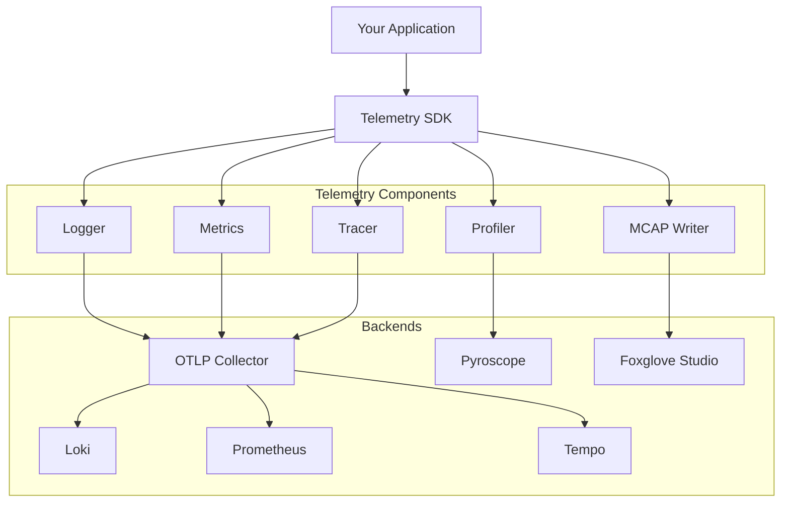
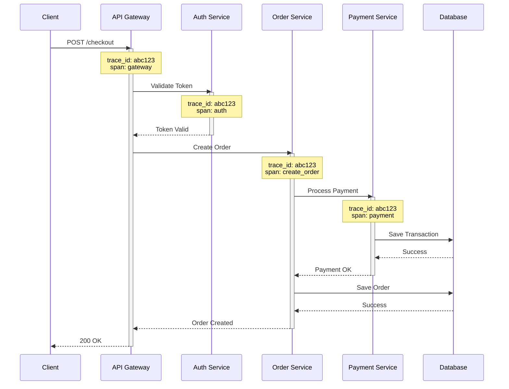
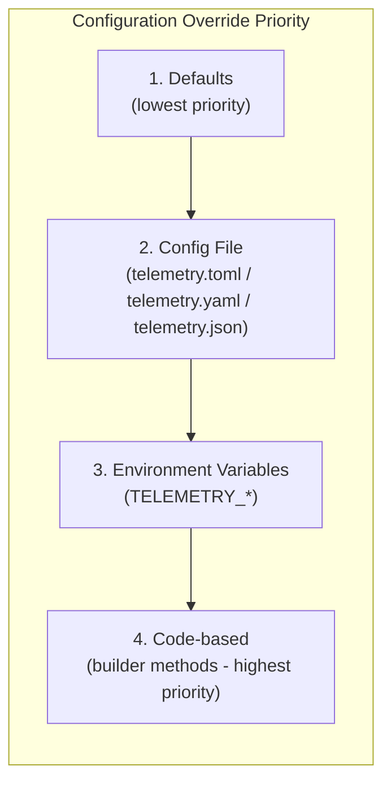

# Telemetry - Go SDK

A comprehensive observability framework for Go applications, providing unified
logging, metrics, tracing, and profiling capabilities with OpenTelemetry
integration.

## Table of Contents

- [Installation](#installation)
- [Quick Start](#quick-start)
- [Architecture](#architecture)
- [Features](#features)
  - [Logging](#logging)
  - [Metrics](#metrics)
    - [Typed Instruments via `Meter()`](#typed-instruments-via-meter-for-generated-code)
  - [Distributed Tracing](#distributed-tracing)
  - [Profiling](#profiling)
  - [MCAP Recording](#mcap-recording)
- [Configuration](#configuration)
- [Examples](#examples)
- [Best Practices](#best-practices)

## Installation

Install the Telemetry SDK using Go modules:

```bash
go get github.com/the-protobuf-project/telemetry/telemetry-go
```

**Requirements:**

- Go 1.25.0 or higher
- OpenTelemetry Collector (optional, for production deployments)
- Foxglove Studio (optional, for MCAP visualization)

## Quick Start

### Minimal Setup (Zero Config)

```go
package main

import "github.com/the-protobuf-project/telemetry/telemetry-go"

func main() {
    // Auto-discovers telemetry.toml or uses defaults
    p, err := telemetry.New().
        WithService("my-service", "1.0.0").
        Build()
    if err != nil {
        panic(err)
    }
    defer p.Close()

    // Start using logging, metrics, and tracing
    p.Logger.Info("Service started")
}
```

### With Configuration File

Create a `telemetry.toml` in your project root (auto-discovered):

```toml
[service]
name = "my-service"
version = "1.0.0"
environment = "production"

[telemetry]
enabled = true

[telemetry.otlp]
endpoint = "otel-collector:4317"
auth_token = "your-token"  # Optional
enabled = true
```

Then in your code:

```go
package main

import "github.com/the-protobuf-project/telemetry/telemetry-go"

func main() {
    // Automatically loads telemetry.toml
    p, err := telemetry.New().Build()
    if err != nil {
        panic(err)
    }
    defer p.Close()

    p.Logger.Info("Service started")
}
```

### With Builder Pattern (Programmatic)

```go
package main

import (
    "github.com/the-protobuf-project/telemetry/telemetry-go"
    "github.com/the-protobuf-project/telemetry/telemetry-go/options"
)

func main() {
    p, err := telemetry.New().
        WithService("robot-controller", "1.0.0").
        WithDescription("Controls robot arm movements").
        WithEnvironment(options.Production).
        WithAttributes(map[string]string{
            "robot.id":  "robot-001",
            "fleet.id":  "fleet-alpha",
            "region":    "us-west-2",
        }).
        WithOTLP("otel-collector", 4317).
        WithTracing().
        Build()
    if err != nil {
        panic(err)
    }
    defer p.Close()

    p.Logger.Info("Robot controller started")
}
```

## Architecture

Telemetry provides a unified observability stack built on OpenTelemetry standards:



## Features

### Logging

Telemetry provides structured logging with automatic context propagation and
OpenTelemetry integration.

#### Basic Logging

```go
// Info level
p.Logger.Info("User logged in", map[string]interface{}{
    "user_id": "12345",
    "ip":      "192.168.1.1",
})

// Warning level
p.Logger.Warn("Rate limit approaching", map[string]interface{}{
    "current": 95,
    "limit":   100,
})

// Error level
err := processRequest()
if err != nil {
    p.Logger.Error("Request processing failed", map[string]interface{}{
        "error":      err.Error(),
        "request_id": "req-123",
    })
}

// Debug level
p.Logger.Debug("Cache hit", map[string]interface{}{
    "key": "user:12345",
    "ttl": 3600,
})
```

#### Structured Attributes

Use structured attributes for better queryability:

```go
p.Logger.Info("Payment processed", map[string]interface{}{
    "transaction_id": "txn-789",
    "amount":         99.99,
    "currency":       "USD",
    "user_id":        "user-456",
    "payment_method": "credit_card",
    "status":         "success",
})
```

#### Context-Aware Logging

Logs automatically include trace context when used with distributed tracing:

```go
func handleRequest(ctx context.Context, p *telemetry.Telemetry) {
    // Logs will include trace_id and span_id automatically
    p.Logger.Info("Processing request", map[string]interface{}{
        "endpoint": "/api/users",
    })
}
```

### Per-Module Log Levels

Telemetry supports per-module log level control, allowing different services or
modules to log at different verbosity levels within the same application.

#### Log Levels

| Constant           | Value | Meaning                                    |
| ------------------ | ----- | ------------------------------------------ |
| `ModuleLevel_Unset`| 0     | No explicit level; use environment default |
| `ModuleLevel_1`    | 1     | Error only — stable, production module     |
| `ModuleLevel_2`    | 2     | Info — normal operation                    |
| `ModuleLevel_3`    | 3     | Debug — active development                 |

#### Priority Chain (Highest to Lowest)

1. **Environment variable** — `TELEMETRY_LOGGING_MODULES_<NAME>_LEVEL`
2. **TOML per-module override** — `[logging.modules.<name>]`
3. **Code-level** — `WithLogLevel()`
4. **Global config** — `[logging] level`
5. **Environment-based default** — dev=Debug, prod=Info, staging=Warn

#### Code Usage

```go
p, err := telemetry.New().
    WithService("vision-module", "1.0.0").
    WithLogLevel(telemetry.ModuleLevel_3). // Debug — full observability
    Build()
```

#### TOML Configuration

```toml
[logging]
level = 2  # Global default: Info

[logging.modules.nats-module]
level = 1  # Override: Error only (overrides code-level WithLogLevel)

[logging.modules.vision-module]
level = 3  # Override: Debug
```

#### Environment Variable Override

```bash
export TELEMETRY_LOGGING_MODULES_NATS_MODULE_LEVEL=1  # Highest priority
```

### Metrics

Telemetry supports OpenTelemetry metrics including counters, gauges, and histograms.

#### Counter Metrics

Track cumulative values that only increase:

```go
// Create a counter
requestCounter, err := p.Metrics.Counter("http_requests_total",
    metric.WithDescription("Total HTTP requests"),
    metric.WithUnit("1"),
)
if err != nil {
    panic(err)
}

// Increment counter with labels
requestCounter.Add(ctx, 1,
    metric.WithAttributes(
        attribute.String("method", "GET"),
        attribute.String("endpoint", "/api/users"),
        attribute.Int("status_code", 200),
    ),
)
```

#### Histogram Metrics

Measure distributions of values (e.g., latencies):

```go
// Create a histogram
latencyHistogram, err := p.Metrics.Histogram("http_request_duration_ms",
    metric.WithDescription("HTTP request duration in milliseconds"),
    metric.WithUnit("ms"),
)
if err != nil {
    panic(err)
}

// Record values
start := time.Now()
// ... process request ...
duration := time.Since(start).Milliseconds()

latencyHistogram.Record(ctx, duration,
    metric.WithAttributes(
        attribute.String("endpoint", "/api/users"),
        attribute.String("method", "GET"),
    ),
)
```

#### Gauge Metrics

Track values that can go up or down:

```go
// Create an observable gauge
activeConnections, err := p.Metrics.Gauge("active_connections",
    metric.WithDescription("Number of active connections"),
)
if err != nil {
    panic(err)
}

// Register callback to report current value
meter.RegisterCallback(func(ctx context.Context, o metric.Observer) error {
    count := getActiveConnectionCount()
    o.ObserveInt64(activeConnections, count)
    return nil
}, activeConnections)
```

#### Typed Instruments via `Meter()` (for generated code)

`p.Meter()` returns a [`runtime-go/telemetry.Meter`](https://github.com/the-protobuf-project/runtime-go/tree/main/telemetry) — a small, backend-agnostic
create-once/record-many instrument interface, distinct from the reflective
`p.Metrics` API above. It exists so generated code (e.g.
[`protoc-gen-telemetry`](plugin/), which turns a `telemetry.v1`-annotated
proto message into a typed `<Name>Metrics` type) can bind to *an interface*
instead of this SDK directly — swap the backend without regenerating or
touching the generated code:

```go
p, err := telemetry.New().WithService("job-worker", "1.0.0").WithMCAP("./metrics.mcap").Build()
if err != nil {
    panic(err)
}
defer p.Close()

metrics := jobsv1.NewJobMetrics(p.Meter()) // generated by protoc-gen-telemetry
metrics.IncCreated(ctx, jobsv1.Job_STATE_QUEUED, "default")
```

Every measurement through `Meter()` flows through this instance's real OTel
meter (OTLP export, when `WithOTLP` is configured) *and* its MCAP writer
(when `WithMCAP` is configured) — the same pipeline `p.Metrics` uses, just
addressed through typed instrument handles instead of struct tags. See
[`examples/telemetry`](examples/telemetry) for a full runnable example: an
annotated proto, generated metrics code, and a small mock service using it.

### Distributed Tracing

Telemetry provides automatic distributed tracing with OpenTelemetry, enabling you
to track requests across service boundaries.

#### Creating Spans

```go
// Start a span
ctx, span := p.Tracing.Start(ctx, "ProcessOrder")
defer span.End()

// Add attributes
span.SetAttribute("order_id", "order-123")
span.SetAttribute("user_id", "user-456")
span.SetAttribute("total_amount", 99.99)

// Add events
span.AddEvent("Payment validated")
span.AddEvent("Inventory checked")

// Record errors
if err != nil {
    span.RecordError(err)
    span.SetStatus(codes.Error, "Order processing failed")
}
```

#### Automatic Struct Tracing

Use the `Trace` helper to automatically extract attributes from structs:

```go
type OrderRequest struct {
    OrderID   string  `telemetry:"trace:order.id"`
    UserID    string  `telemetry:"trace:user.id"`
    Amount    float64 `telemetry:"trace:order.amount"`
    Currency  string  `telemetry:"trace:order.currency"`
}

func processOrder(
    ctx context.Context, p *telemetry.Telemetry, req OrderRequest,
) error {
    return p.Tracing.Trace(
        ctx, "ProcessOrder", req,
        func(ctx context.Context, span *telemetry.Span) error {
        // Attributes are automatically added from struct tags
        span.AddEvent("Processing started")

        // Your business logic here
        err := validatePayment(ctx, req)
        if err != nil {
            return err
        }

        span.AddEvent("Processing completed")
        span.SetOK()
        return nil
    })
}
```

#### Nested Spans

Create hierarchical traces to understand complex workflows:

```go
func handleCheckout(
    ctx context.Context, p *telemetry.Telemetry,
) error {
    return p.Tracing.Trace(
        ctx, "Checkout", nil,
        func(ctx context.Context, span *telemetry.Span) error {
        // Child span 1: Validate cart
        ctx, err := validateCart(ctx, p)
        if err != nil {
            return err
        }

        // Child span 2: Process payment
        ctx, err = processPayment(ctx, p)
        if err != nil {
            return err
        }

        // Child span 3: Update inventory
        return updateInventory(ctx, p)
    })
}

func validateCart(ctx context.Context, p *telemetry.Telemetry) (context.Context, error) {
    ctx, span := p.Tracing.Start(ctx, "ValidateCart")
    defer span.End()

    // Validation logic
    span.SetOK()
    return ctx, nil
}
```

#### Distributed Tracing Flow



### Profiling

Continuous profiling with Pyroscope integration for production performance analysis.

#### Enable Profiling

```go
p, err := telemetry.New(ctx, serviceOpts, options.TelemetryOptions{
    Profiling: options.ProfilingOptions{
        Enabled:        true,
        ApplicationURL: "http://pyroscope:4040",
        ServerAddress:  "http://pyroscope:4040",
        ProfileTypes: []options.ProfileType{
            options.ProfileCPU,
            options.ProfileMemory,
            options.ProfileGoroutine,
            options.ProfileMutex,
            options.ProfileBlock,
        },
    },
})
```

#### Profile Types

- **CPU Profile**: Identifies CPU-intensive code paths
- **Memory Profile**: Tracks memory allocations and leaks
- **Goroutine Profile**: Monitors goroutine creation and lifecycle
- **Mutex Profile**: Detects lock contention
- **Block Profile**: Identifies blocking operations

#### Custom Profile Labels

Add labels to correlate profiles with specific operations:

```go
func processRequest(ctx context.Context, userID string) {
    // Add labels for this execution context
    pprof.Do(ctx, pprof.Labels(
        "user_id", userID,
        "endpoint", "/api/process",
    ), func(ctx context.Context) {
        // Your code here - profiles will include these labels
        heavyComputation()
    })
}
```

### MCAP Recording

Record telemetry data to MCAP files for offline analysis in Foxglove Studio.

#### Enable MCAP

```go
p, err := telemetry.New(ctx, serviceOpts, options.TelemetryOptions{
    Foxglove: options.FoxgloveOptions{
        Enabled:  true,
        McapPath: "/var/logs/my-service.mcap",
    },
})
```

#### What Gets Recorded

- Structured logs with timestamps
- Metric values and labels
- Trace spans and events
- Custom application data

#### Viewing MCAP Files

1. Open Foxglove Studio
2. Load the MCAP file
3. Visualize logs, metrics, and traces in a unified timeline
4. Correlate events across different telemetry signals

## Configuration

Telemetry supports multiple configuration methods with automatic discovery.

### Configuration File Formats

Telemetry auto-discovers config files in this order:

1. `TELEMETRY_CONFIG_PATH` environment variable
2. `telemetry.toml` in current directory
3. `telemetry.yaml` / `telemetry.yml` / `telemetry.json`
4. `.config/telemetry.toml` / `.config/telemetry.yaml` / `.config/telemetry.json`

#### TOML Configuration (Recommended)

```toml
# telemetry.toml
[service]
name = "my-service"
version = "1.0.0"
environment = "production"  # development | staging | production
description = "My awesome service"

# Global attributes added to ALL telemetry
[service.attributes]
robot_id = "robot-001"
fleet_id = "fleet-alpha"

[telemetry]
enabled = true  # Master switch for logging, metrics, tracing

[telemetry.otlp]
enabled = true
endpoint = "otel-collector:4317"  # Port auto-detected if omitted
auth_token = "your-bearer-token"  # Optional authentication
# secure = false                   # Auto-detected for non-localhost
# use_http = false                 # Use gRPC by default

[telemetry.metrics]
export_interval_seconds = 10

[logging]
level = 2                        # Global log level (1=Error, 2=Info, 3=Debug)

[logging.log]
report_caller = true
report_timestamp = true

# Per-module log level overrides
# [logging.modules.nats-module]
# level = 1                      # Error only for this module

[foxglove]
enabled = false
file_path = "./recordings/session.mcap"

[profiling]
enabled = false
server_address = "http://pyroscope:4040"

[tracing]
enabled = true
```

#### YAML Configuration

```yaml
# telemetry.yaml
service:
  name: my-service
  version: "1.0.0"
  environment: production
  attributes:
    robot_id: robot-001
    fleet_id: fleet-alpha

telemetry:
  enabled: true
  otlp:
    enabled: true
    endpoint: otel-collector:4317
    auth_token: your-bearer-token
  metrics:
    export_interval_seconds: 10

logging:
  log:
    report_caller: true
    report_timestamp: true

tracing:
  enabled: true
```

#### JSON Configuration

```json
{
  "service": {
    "name": "my-service",
    "version": "1.0.0",
    "environment": "production",
    "attributes": {
      "robot_id": "robot-001"
    }
  },
  "telemetry": {
    "enabled": true,
    "otlp": {
      "enabled": true,
      "endpoint": "otel-collector:4317"
    }
  },
  "tracing": {
    "enabled": true
  }
}
```

### Environment Variables

Environment variables override config file values. Use `TELEMETRY_` prefix:

```bash
export TELEMETRY_TELEMETRY_OTLP_ENDPOINT=otel-collector:4317
export TELEMETRY_TELEMETRY_OTLP_AUTH_TOKEN=your-token
export TELEMETRY_SERVICE_NAME=my-service
```

### Builder Pattern API

For programmatic configuration:

```go
p, err := telemetry.New().
    // Load from specific config file (optional)
    WithConfig("./config/telemetry.toml").

    // Service identification
    WithService("payment-service", "2.1.0").
    WithDescription("Handles payment processing").
    WithEnvironment(options.Production).

    // Global attributes (appear on all telemetry)
    WithAttributes(map[string]string{
        "robot.id": "robot-001",
        "fleet.id": "fleet-alpha",
    }).

    // OTLP endpoint (port auto-detected)
    WithOTLP("otel-collector", 4317).
    WithOTLPHeaders(map[string]string{
        "Authorization": "Bearer your-token",
    }).

    // Enable features
    WithTracing().
    WithProfiling("http://pyroscope:4040").
    WithMCAP("./recordings/session.mcap").

    Build()
```

### Configuration Priority



## Examples

### Complete LLM Pipeline with Tracing

This example demonstrates distributed tracing across an LLM conversation
pipeline with proper span hierarchy:

```go
package main

import (
    "context"
    "time"
    "github.com/the-protobuf-project/telemetry/telemetry-go"
    "github.com/the-protobuf-project/telemetry/telemetry-go/options"
)

type ConversationRequest struct {
    RequestID string `telemetry:"trace:request.id"`
    UserInput string `telemetry:"trace:input.text"`
    UserID    string `telemetry:"trace:user.id"`
}

func main() {
    // Initialize with builder pattern
    p, err := telemetry.New().
        WithService("llm-service", "1.0.0").
        WithEnvironment(options.Production).
        WithTracing().
        Build()
    if err != nil {
        panic(err)
    }
    defer p.Close()

    // Process conversation
    ctx := context.Background()
    req := ConversationRequest{
        RequestID: "req-123",
        UserInput: "What are the best practices for distributed tracing?",
        UserID:    "user-456",
    }

    err = processConversation(ctx, p, req)
    if err != nil {
        p.Logger.Error("Conversation failed", map[string]interface{}{
            "error": err.Error(),
        })
    }
}

func processConversation(
    ctx context.Context, p *telemetry.Telemetry, req ConversationRequest,
) error {
    return p.Tracing.Trace(
        ctx, "ConversationPipeline", req,
        func(ctx context.Context, span *telemetry.Span) error {
        span.AddEvent("pipeline_started")

        // Step 1: Process input
        processed, err := processInput(ctx, p, req.UserInput)
        if err != nil {
            return err
        }
        span.SetAttribute("input_tokens", len(processed))

        // Step 2: Retrieve context
        contextData, err := retrieveContext(ctx, p, req.UserID)
        if err != nil {
            return err
        }
        span.SetAttribute("context_items", len(contextData))

        // Step 3: Generate response
        response, err := generateResponse(ctx, p, processed, contextData)
        if err != nil {
            return err
        }
        span.SetAttribute("response_length", len(response))

        span.AddEvent("pipeline_completed")
        span.SetOK()
        return nil
    })
}

func processInput(
    ctx context.Context, p *telemetry.Telemetry, input string,
) (string, error) {
    _, span := p.Tracing.Start(ctx, "InputProcessing")
    defer span.End()

    span.AddEvent("validating_input")
    time.Sleep(15 * time.Millisecond)

    span.AddEvent("normalizing_text")
    time.Sleep(20 * time.Millisecond)

    span.SetAttribute("input_length", len(input))
    span.SetOK()

    return input, nil
}

func retrieveContext(
    ctx context.Context, p *telemetry.Telemetry, userID string,
) ([]string, error) {
    _, span := p.Tracing.Start(ctx, "ContextRetrieval")
    defer span.End()

    span.AddEvent("checking_cache")
    time.Sleep(5 * time.Millisecond)

    span.AddEvent("fetching_history")
    time.Sleep(40 * time.Millisecond)

    context := []string{"previous message 1", "previous message 2"}
    span.SetAttribute("context_count", len(context))
    span.SetOK()

    return context, nil
}

func generateResponse(
    ctx context.Context, p *telemetry.Telemetry, input string, context []string,
) (string, error) {
    _, span := p.Tracing.Start(ctx, "ResponseGeneration")
    defer span.End()

    span.AddEvent("preparing_prompt")
    time.Sleep(20 * time.Millisecond)

    span.AddEvent("calling_llm")
    time.Sleep(180 * time.Millisecond)

    span.AddEvent("parsing_response")
    time.Sleep(15 * time.Millisecond)

    response := "Distributed tracing best practices include: " +
        "1) Use correlation IDs, 2) Propagate context..."
    span.SetAttribute("response_tokens", len(response))
    span.SetOK()

    return response, nil
}
```

### Metrics and Logging Example

```go
package main

import (
    "context"
    "time"
    "github.com/the-protobuf-project/telemetry/telemetry-go"
    "go.opentelemetry.io/otel/attribute"
    "go.opentelemetry.io/otel/metric"
)

func main() {
    // Initialize with builder pattern
    p, _ := telemetry.New().
        WithService("api-server", "1.0.0").
        Build()
    defer p.Close()

    ctx := context.Background()

    // Create metrics
    requestCounter, _ := p.Metrics.Counter("http_requests_total")
    requestDuration, _ := p.Metrics.Histogram("http_request_duration_ms")

    // Simulate HTTP requests
    for i := 0; i < 10; i++ {
        start := time.Now()

        // Log request
        p.Logger.Info("Handling request", map[string]interface{}{
            "request_id": i,
            "method":     "GET",
            "path":       "/api/users",
        })

        // Simulate work
        time.Sleep(time.Duration(50+i*10) * time.Millisecond)

        // Record metrics
        duration := time.Since(start).Milliseconds()
        requestCounter.Add(ctx, 1,
            metric.WithAttributes(
                attribute.String("method", "GET"),
                attribute.String("path", "/api/users"),
                attribute.Int("status", 200),
            ),
        )
        requestDuration.Record(ctx, duration,
            metric.WithAttributes(
                attribute.String("method", "GET"),
                attribute.String("path", "/api/users"),
            ),
        )

        p.Logger.Info("Request completed", map[string]interface{}{
            "request_id":  i,
            "duration_ms": duration,
            "status":      200,
        })
    }
}
```

## Best Practices

### 1. Always Close Telemetry

Ensure proper cleanup of resources:

```go
p, err := telemetry.New().
    WithService("my-service", "1.0.0").
    Build()
if err != nil {
    return err
}
defer p.Close()
```

### 2. Use Structured Logging

Prefer structured attributes over string concatenation:

```go
// Good
p.Logger.Info("User action", map[string]interface{}{
    "user_id": userID,
    "action":  "login",
    "ip":      ipAddress,
})

// Avoid
p.Logger.Info(fmt.Sprintf("User %s logged in from %s", userID, ipAddress), nil)
```

### 3. Add Context to Spans

Enrich spans with relevant attributes:

```go
span.SetAttribute("user_id", userID)
span.SetAttribute("order_total", total)
span.SetAttribute("payment_method", method)
```

### 4. Handle Errors in Traces

Always record errors in spans:

```go
if err != nil {
    span.RecordError(err)
    span.SetStatus(codes.Error, "Operation failed")
    return err
}
span.SetOK()
```

### 5. Use Appropriate Metric Types

- **Counter**: Cumulative values (requests, errors)
- **Histogram**: Distributions (latencies, sizes)
- **Gauge**: Current values (connections, queue depth)

### 6. Environment-Specific Configuration

Adjust telemetry based on environment:

```go
opts := options.TelemetryOptions{}
if env == options.Production {
    opts.Telemetry.Tracing.Enabled = true
    opts.Profiling.Enabled = true
}
```

### 7. Cardinality Management

Avoid high-cardinality labels in metrics:

```go
// Good - bounded cardinality
metric.WithAttributes(
    attribute.String("endpoint", "/api/users"),
    attribute.String("method", "GET"),
)

// Avoid - unbounded cardinality
metric.WithAttributes(
    attribute.String("user_id", userID), // Could be millions of values
)
```

## License

Copyright © 2026 Machani Robotics

Licensed under the Apache License, Version 2.0.
