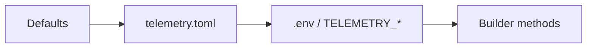

# Telemetry - Python SDK

A comprehensive observability framework for Python applications, providing
unified logging, metrics, and distributed tracing capabilities with
OpenTelemetry integration and MCAP recording for Foxglove Studio.

## Table of Contents

- [Features](#features)
- [Installation](#installation)
- [Quick Start](#quick-start)
- [Configuration](#configuration)
- [Core Concepts](#core-concepts)
- [Examples](#examples)
- [Best Practices](#best-practices)

## Features

- **Logging** - Structured logging with OTLP export and MCAP recording
- **Metrics** - Pydantic-based metrics with automatic service name prefix
- **Tracing** - Decorator-based distributed tracing
- **MCAP Recording** - Unified file for Foxglove Studio visualization
- **Config-first** - Auto-discovers `telemetry.toml` with environment variable overrides

## Installation

```bash
# Using pip
pip install git+https://github.com/the-protobuf-project/telemetry.git#subdirectory=telemetry-py

# Using uv (recommended)
cd telemetry-py && uv sync
```

**Requirements:** Python 3.12+

## Quick Start

### 1. Create `telemetry.toml` in your project root

```toml
[service]
name = "my-service"
version = "1.0.0"
environment = "development"

[telemetry.otlp]
endpoint = "otel.example.com"
auth_token = "your-token"
```

### 2. Use Telemetry in your code

```python
from telemetry import Telemetry

# Auto-discovers telemetry.toml config
with Telemetry.new().build() as telemetry:
    telemetry.logger.info("Service started")
    telemetry.logger.warning("Rate limit approaching", {"percent": 85})
```

That's it! No manual configuration needed.

## Configuration

Configuration is loaded in priority order (lowest to highest):



### Config File (`telemetry.toml`)

```toml
[service]
name = "my-service"
version = "1.0.0"
environment = "development"  # development | staging | production

[telemetry.otlp]
endpoint = "otel.example.com"  # Port 4317 auto-added for gRPC
auth_token = "your-token"
secure = false                  # Use TLS

[logging]
level = 2                      # Global log level (1=Error, 2=Info, 3=Debug)

# Per-module log level overrides
# [logging.modules.nats-module]
# level = 1                    # Error only for this module

[foxglove]
enabled = true
file_path = "/tmp/telemetry.mcap"

[tracing]
enabled = true
```

### Environment Variables

Override config with `TELEMETRY_` prefix and double underscores for nesting:

```bash
# .env
TELEMETRY_SERVICE__NAME=my-service
TELEMETRY_TELEMETRY__OTLP__ENDPOINT=otel.example.com
TELEMETRY_TELEMETRY__OTLP__AUTH_TOKEN=your-token
```

### Builder Pattern (Code Overrides)

```python
from telemetry import Telemetry, Environment

# Builder methods have highest priority
telemetry = Telemetry.new() \
    .with_service("my-service", "1.0.0") \
    .environment(Environment.PRODUCTION) \
    .with_otlp("otel.example.com", 4317) \
    .build()
```

## Core Concepts

### Logging

```python
from telemetry import Telemetry

with Telemetry.new().build() as telemetry:
    telemetry.logger.info("User logged in", {"user_id": "123"})
    telemetry.logger.warning("Rate limit", {"percent": 85})
    telemetry.logger.error("Request failed", {"error": "timeout"})
```

### Per-Module Log Levels

Telemetry supports per-module log level control, allowing different services or
modules to log at different verbosity levels within the same application.

#### Log Levels

| Constant                   | Value | Meaning                                    |
| -------------------------- | ----- | ------------------------------------------ |
| `LogLevel.UNSET`           | 0     | No explicit level; use environment default |
| `LogLevel.MODULE_LEVEL_1`  | 1     | Error only — stable, production module     |
| `LogLevel.MODULE_LEVEL_2`  | 2     | Info — normal operation                    |
| `LogLevel.MODULE_LEVEL_3`  | 3     | Debug — active development                 |

#### Priority Chain (Highest to Lowest)

1. **Environment variable** — `TELEMETRY_LOGGING_MODULES_<NAME>_LEVEL`
2. **TOML per-module override** — `[logging.modules.<name>]`
3. **Code-level** — `.with_log_level()`
4. **Global config** — `[logging] level`
5. **Environment-based default** — dev=Debug, prod=Info, staging=Warn

#### Code Usage

```python
from telemetry import Telemetry, LogLevel

telemetry = Telemetry.new() \
    .with_service("vision-module", "1.0.0") \
    .with_log_level(LogLevel.MODULE_LEVEL_3) \
    .build()
```

#### TOML Configuration

```toml
[logging]
level = 2  # Global default: Info

[logging.modules.nats-module]
level = 1  # Override: Error only (overrides code-level with_log_level)

[logging.modules.vision-module]
level = 3  # Override: Debug
```

#### Environment Variable Override

```bash
export TELEMETRY_LOGGING_MODULES_NATS_MODULE_LEVEL=1  # Highest priority
```

### Metrics

Metrics are auto-prefixed with service name from config:

```python
import telemetry
from telemetry import Telemetry, MetricsBaseModel

# No prefix needed - uses service name from telemetry.toml
class LLMMetrics(MetricsBaseModel):
    tokens: int = telemetry.Counter(description="Total tokens")
    latency: float = telemetry.Histogram(description="Response time")
    active: int = telemetry.Gauge(description="Active requests")

with Telemetry.new().build() as p:
    metrics = LLMMetrics(tokens=150, latency=245.5, active=3)
    p.metrics.record(metrics)
    # Generates: my-service.tokens, my-service.latency, my-service.active
```

### Tracing

```python
import telemetry
from telemetry import Telemetry, TracedOperation

@telemetry.trace("process_request", auto_events=True)
def process_request(user_id: str):
    return {"status": "success"}

with Telemetry.new().build() as p:
    # Using decorator
    result = process_request("user-123")

    # Using TracedOperation
    with TracedOperation(p.tracing, "pipeline") as op:
        op.step("loading")
        op.step("processing")
        op.step("saving")
```

## Examples

```bash
# Run examples
uv run python examples/logging/simple_example.py
uv run python examples/metrics/simple_example.py
uv run python examples/tracing/simple_example.py
uv run python examples/modules/example.py
```

## Best Practices

1. **Use `Telemetry.new().build()`** - Auto-discovers config from `telemetry.toml`
2. **Use context managers** - Ensures proper cleanup
3. **Structured logging** - Pass dicts, not f-strings
4. **No metric prefix needed** - Service name is auto-prefixed

## License

Copyright © 2026 The Protobuf Project. Apache License 2.0.
